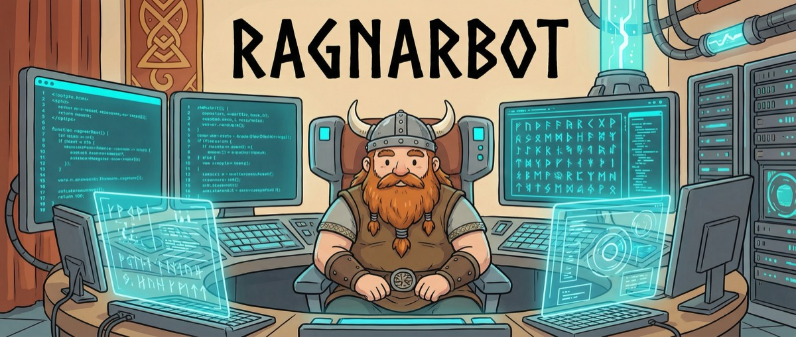

<div align="center">
  
</div>

<p align="center">
  <em>Async-first personal AI assistant. Lightweight, extensible, runs anywhere.</em>
</p>

---

## Install

Install [uv](https://github.com/astral-sh/uv) if you don't have it:

```bash
curl -LsSf https://astral.sh/uv/install.sh | sh
```

Then install ragnarbot:

```bash
uv tool install ragnarbot-ai
```

## Quick Start

**1. Initialize**

```bash
ragnarbot onboard
```

**2. Configure**

Add your API key to `~/.ragnarbot/config.json`:

```json
{
  "providers": {
    "anthropic": {
      "apiKey": "sk-ant-xxx"
    }
  }
}
```

Get an API key from [Anthropic](https://console.anthropic.com/keys), [OpenAI](https://platform.openai.com/api-keys), or [Google AI Studio](https://aistudio.google.com/apikey).

**3. Chat**

```bash
ragnarbot agent -m "What can you do?"
```

Or start an interactive session:

```bash
ragnarbot agent
```

## Telegram

ragnarbot is designed to work through Telegram. Set up a bot, point it at your instance, and you have a personal AI assistant in your pocket.

**Create a bot**

Open Telegram, find `@BotFather`, send `/newbot`, and follow the prompts. Copy the token.

**Get your user ID**

Message `@userinfobot` on Telegram to get your numeric user ID.

**Add to config**

```json
{
  "channels": {
    "telegram": {
      "enabled": true,
      "token": "YOUR_BOT_TOKEN",
      "allowFrom": ["YOUR_USER_ID"]
    }
  }
}
```

**Run the gateway**

```bash
ragnarbot gateway
```

Your bot is live. Message it from Telegram.

## Configuration

All configuration lives in `~/.ragnarbot/config.json`. Keys are camelCase.

### Providers

Only one provider is required. ragnarbot uses [LiteLLM](https://github.com/BerriAI/litellm) under the hood, so any model string LiteLLM supports will work.

| Provider | Config key | Models | API Key |
|----------|-----------|--------|---------|
| Anthropic | `providers.anthropic` | `anthropic/claude-*` | [console.anthropic.com](https://console.anthropic.com) |
| OpenAI | `providers.openai` | `openai/gpt-*` | [platform.openai.com](https://platform.openai.com) |
| Gemini | `providers.gemini` | `gemini/*` | [aistudio.google.com](https://aistudio.google.com) |

Set the default model under `agents.defaults.model`.

### Transcription

Voice messages in Telegram are automatically transcribed when a Groq API key is configured. Groq provides free access to Whisper.

```json
{
  "transcription": {
    "apiKey": "gsk_xxx"
  }
}
```

Get a key at [console.groq.com](https://console.groq.com).

### Web Search

ragnarbot can search the web via the Brave Search API.

```json
{
  "tools": {
    "web": {
      "search": {
        "apiKey": "BSA-xxx"
      }
    }
  }
}
```

Get a key at [brave.com/search/api](https://brave.com/search/api/).

## CLI Reference

| Command | Description |
|---------|-------------|
| `ragnarbot onboard` | Initialize config and workspace |
| `ragnarbot agent -m "..."` | Send a single message |
| `ragnarbot agent` | Interactive chat session |
| `ragnarbot gateway` | Start gateway (Telegram + cron + heartbeat) |
| `ragnarbot status` | Show configuration status |
| `ragnarbot channels status` | Show channel status |
| `ragnarbot cron list` | List scheduled jobs |
| `ragnarbot cron add` | Add a scheduled job |
| `ragnarbot cron remove <id>` | Remove a scheduled job |

## Architecture

ragnarbot is async-first and built around a simple message-passing architecture:

```
Telegram --> MessageBus --> AgentLoop --> LLM --> Tools
                                  \                /
                                   \-- Sessions --/
```

**MessageBus** decouples channels from agent logic using async queues. Channels publish inbound messages; the agent publishes responses back.

**AgentLoop** consumes messages, builds context (system prompt, conversation history, skills), calls the LLM, and executes tool calls in a loop. It also exposes a `process_direct()` path for CLI usage and cron jobs.

**Tools** are registered in a `ToolRegistry` and exposed to the LLM as OpenAI-compatible function calls. Built-in tools include file operations, shell execution, web search, cron management, and sub-agent spawning.

**Skills** are markdown files with YAML frontmatter. Skills marked `always: true` are included in every prompt; others appear as summaries the agent can load on demand.

**Sessions** persist conversation history as JSONL files under `~/.ragnarbot/sessions/`.

## License

MIT

---

<sub>Based on [nanobot](https://github.com/HKUDS/nanobot)</sub>
